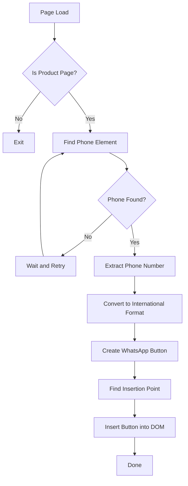

# Jiji.ng WhatsApp Button Chrome Extension - Architecture Plan

## Overview
Create a Chrome extension (Manifest V3) that adds a "Text on WhatsApp" button to all product pages on jiji.ng. The button will allow users to directly message sellers via WhatsApp.

## Requirements
- **Target Site**: jiji.ng product/advert pages
- **Button Text**: "Text on WhatsApp"
- **WhatsApp Link Format**: `https://wa.me/+234{phone_without_leading_zero}`
- **Phone Format Conversion**: Nigerian numbers like `08063243659` → `+2348063243659`

## Page Analysis

### URL Pattern
Product pages follow this pattern:
```
https://jiji.ng/{region}/{category}/{product-slug}.html
```
Example: `https://jiji.ng/surulere/automotive-services/car-diagnostic-expert-for-bmw-kia-m-benz-lexus-hyundai-toyota-BpFSZSRnYTzRxxP6sFc2W7L5.html`

### Phone Number Location
The seller's phone number appears in anchor tags with the following selectors:

**Primary Selector:**
```css
a.qa-show-contact[href^="tel:"]
```

**HTML Structure:**
```html
<a rel="nofollow" class="qa-show-contact cy-show-contact js-show-contact b-show-contact" href="tel:08063243659">
  <span class="qa-show-contact-phone b-button b-button--primary b-button--border-radius-8 b-button--size-full">08063243659</span>
</a>
```

### Button Placement
The WhatsApp button should be inserted after the "Start chat" button in the seller info section:

**Target Container:**
```css
.b-start-chat
```

**Existing Structure:**
```html
<div class="b-start-chat h-flex h-width-100p h-mt-8">
  <!-- Start chat button here -->
</div>
<!-- INSERT WHATSAPP BUTTON HERE -->
```

## Extension Architecture

### File Structure
```
jiji-whatsapp-extension/
├── manifest.json          # Extension manifest (v3)
├── content.js             # Content script for page manipulation
├── styles.css             # Button styling
└── icons/                 # Extension icons (optional)
    ├── icon16.png
    ├── icon48.png
    └── icon128.png
```

### manifest.json
```json
{
  "manifest_version": 3,
  "name": "Jiji WhatsApp Button",
  "version": "1.0.0",
  "description": "Adds a Text on WhatsApp button to Jiji.ng product pages",
  "permissions": [],
  "content_scripts": [
    {
      "matches": ["https://jiji.ng/*/*.html*", "https://www.jiji.ng/*/*.html*"],
      "js": ["content.js"],
      "css": ["styles.css"],
      "run_at": "document_idle"
    }
  ],
  "icons": {
    "16": "icons/icon16.png",
    "48": "icons/icon48.png",
    "128": "icons/icon128.png"
  }
}
```

### content.js Logic



**Key Functions:**
1. `extractPhoneNumber()` - Gets phone from `a[href^="tel:"]` element
2. `formatPhoneForWhatsApp(phone)` - Converts `08063243659` to `+2348063243659`
3. `createWhatsAppButton(phoneNumber)` - Creates the button element
4. `insertButton(button)` - Inserts button into the page

### Phone Number Conversion Logic
```javascript
function formatPhoneForWhatsApp(phone) {
  // Remove any non-digit characters
  let cleaned = phone.replace(/\D/g, '');
  
  // Handle different formats
  if (cleaned.startsWith('234')) {
    // Already has country code: 2348063243659
    return '+' + cleaned;
  } else if (cleaned.startsWith('0')) {
    // Local format: 08063243659 -> +2348063243659
    return '+234' + cleaned.substring(1);
  } else {
    // Just the number without leading 0: 8063243659
    return '+234' + cleaned;
  }
}
```

### Button Styling
The button should match jiji.ng's existing button styles:
- Green color scheme: `#25D366` (WhatsApp green) or `#00B53F` (Jiji green)
- Border radius: 8px
- Full width
- Similar padding and font to existing buttons

## Implementation Steps

1. **Create manifest.json** - Define extension metadata and permissions
2. **Create content.js** - Implement phone extraction and button injection
3. **Create styles.css** - Style the WhatsApp button
4. **Test locally** - Load unpacked extension and test on jiji.ng
5. **Handle edge cases** - Dynamic content loading, multiple phone numbers

## Edge Cases to Handle

1. **Dynamic Content Loading**: jiji.ng uses Vue.js/Nuxt, so content may load dynamically. Use MutationObserver to detect when phone elements appear.

2. **Multiple Phone Numbers**: Some pages may have multiple phone elements. Target the one in the seller info section.

3. **Phone Number Visibility**: The phone number might be hidden initially and revealed on click. May need to observe DOM changes.

4. **Already Existing Button**: Check if WhatsApp button already exists before adding to prevent duplicates.

## Testing Checklist

- [ ] Extension loads without errors
- [ ] Button appears on product pages
- [ ] Button does NOT appear on non-product pages (home, search results)
- [ ] Phone number is correctly extracted
- [ ] WhatsApp link opens correctly with proper phone format
- [ ] Button styling matches site design
- [ ] Works with dynamically loaded content
- [ ] No duplicate buttons on page navigation
